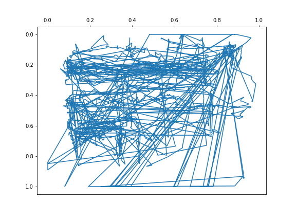
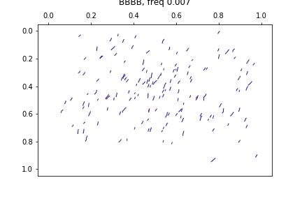
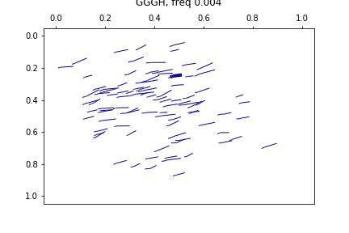
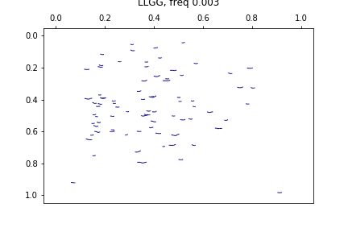
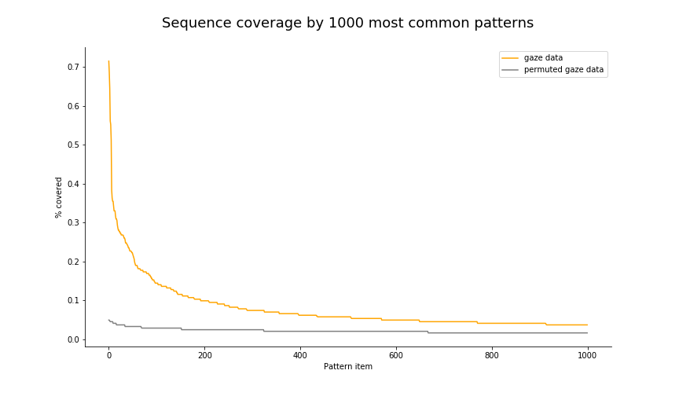
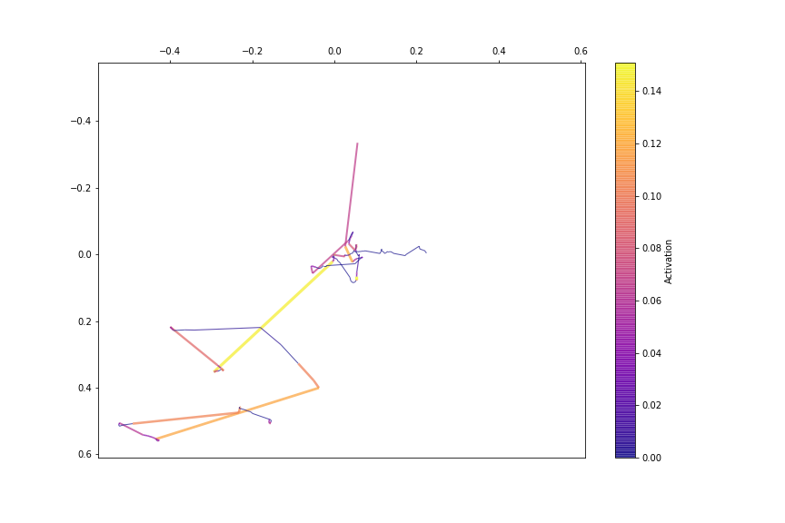
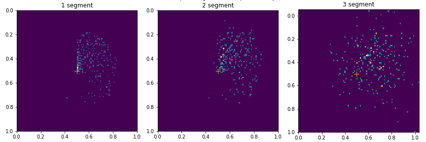
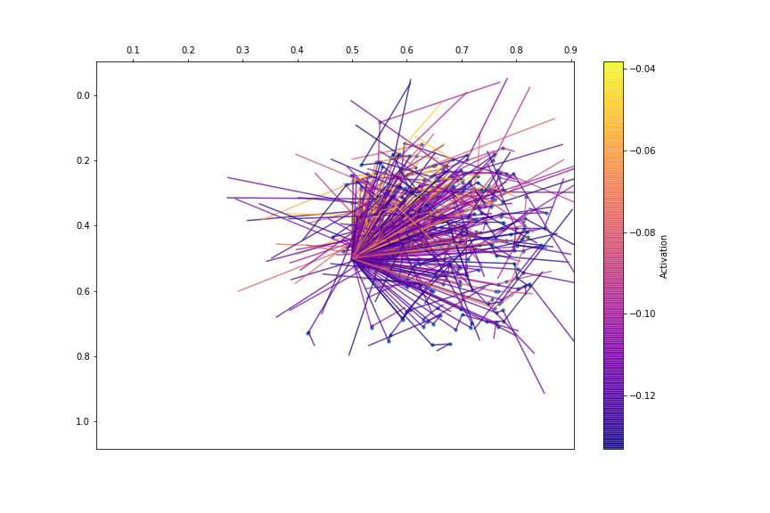

# Detect patterns in data

In this project I work with eye-tracking data (eye-movements) and compare different approaches for detecting patterns in the trajectories of the movements: 

- convert data into strings and detect patterns in strings,
- represent data as a set of time sequences, train convolutional network and detect pattern using filters of the first conv layer.


### Prerequisites

Required libraries:

```
numpy
pandas
keras
```
### How to:

#### Prepare data

`prepare_data.ipynb`

&rarr; Preprocess raw data and compute basic features for detecting patterns in trajectories:

	- movement direction
	- movement length


#### Find patterns in strings

`patterns_strings.ipynb`

&rarr; Factorize features and convert factors into sequences. Find patterns in sequences and visualize them.


#### Find patterns using convolutional networks

`patterns_conv.ipynb`

&rarr; Convert data into time sequences, train a network with 1D Convolutional layers to detect the task user is performing. Extract weights from the first layer and check what kind of patterns are detected by them.


## Data and results:

The demo data is represented by eye-tracker observations of users doing some routine web-surfing tasks such as:
- reading Wikipedia,
- checking news,
- searching a route on maps,
- watching YouTube,
- checking a social network (vk)
- or going through Pinterest search results.

While performing the tasks, their eye-movements were recorded: `x`, `y` variables denote gaze position on a screen, `time` determines time from the beginning of the recording to the current observation.

Position `(0, 0)` means the left upper corner of the screen.

The data was cleaned: only fixations were left and observations where a blink was detected were removed.

A slice of the data: 



#### Find patterns in strings

Examples of patterns, detected from strings:

  

The comparison of the pattern's coverage in real and permuted data:



#### Find patterns using convolutional networks

Highlighting the areas of a sequence which activates a filter in conv_1 layer:



Simulate data and plot heatmaps of gaze positions to understand the filter's properties (filter size equals 3):



Plot the best stimuli for the filter from the simulated data:




## Authors

* **Katerina Malakhova** - [taneta](https://github.com/taneta)


## License

This project is licensed under the MIT License - see the [LICENSE.md](LICENSE.md) file for details